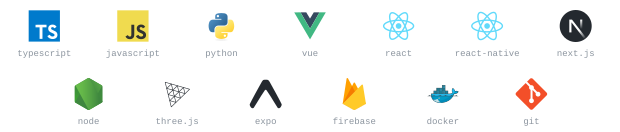

[izuchukwutony.com](https://izuchukwutony.com/) &nbsp;·&nbsp;
[linkedin](https://www.linkedin.com/in/izuchukwu-tony-9aa592218/) &nbsp;·&nbsp;
[email](mailto:izuchukwuonuoha6@gmail.com)

> Software engineer in Manchester. Frontend, product, fullstack. 
> Interfaces people actually use, systems that hold up behind them.

I design and ship client-facing products. Lead frontend and product 
design at Klarnow, after a BSc in Computer Science (Software 
Engineering) at the University of Northampton. Before that, interned 
at Calaya Engineering, which i contributed to the building and maintaining of their systems and infrastructure.

**[izuchukwutony.com](https://izuchukwutony.com/)** &nbsp;·&nbsp; <samp>vue, three.js, gsap</samp> 
Personal site: three.js scenes, Lenis scroll, the long-form version 
of this page.

**[calaya-web](https://github.com/Izu-kun23/calaya-web)** &nbsp;·&nbsp; <samp>next.js</samp> 
The Calaya Engineering site — mission, services, brand. Shipped on 
the internship, still live at [calaya-web.vercel.app](https://calaya-web.vercel.app).

**[lms-frontend](https://github.com/Izu-kun23/lms-frontend)** &nbsp;·&nbsp; <samp>typescript, next.js</samp> 
Learning-management frontend: tables, dashboards, student flows.

**[one.ng](https://github.com/Izu-kun23/one.ng)** &nbsp;·&nbsp; <samp>react native, expo</samp> 
Mobile client for one.ng — maps, location, native shells for iOS 
and Android.

